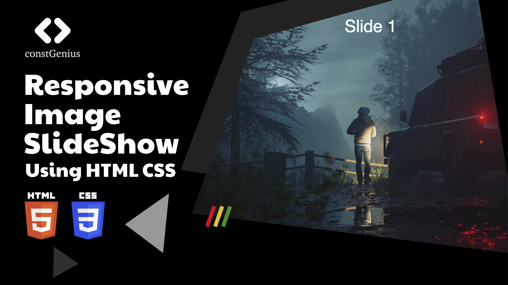

# Responsive Image Slideshow using HTML CSS | Pure CSS Responsive Image Slider 

This HTML and CSS code snippet enables the creation of a responsive image slideshow without the need for any JavaScript. By implementing a pure CSS approach, this responsive image slider is designed to seamlessly adjust to various screen sizes and devices, ensuring optimal viewing experiences across different platforms. With the use of keyframe animations and CSS properties, the code facilitates smooth transitions between multiple images, creating an engaging and visually appealing slideshow effect. This approach simplifies the process of integrating a responsive image slider into web projects, providing a user-friendly and lightweight solution for showcasing a series of images in a dynamic and adaptable manner.

Youtube Tutorial Link: https://youtu.be/wgxb5gRNOU0

Live Preview: https://constgenius.github.io/ResponsiveImageSlideshow/

